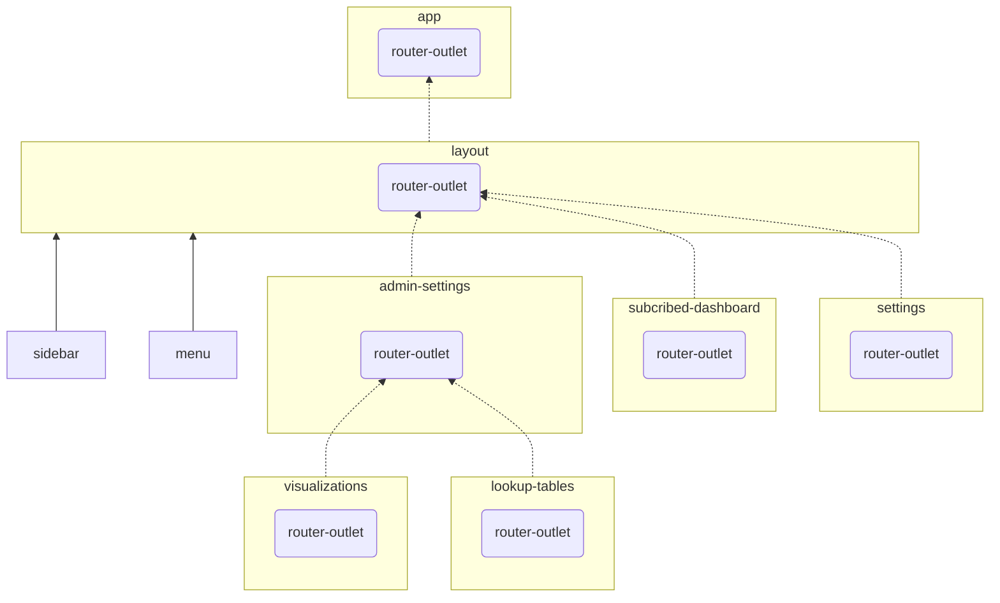

```mermaid
graph BT;
    subgraph x1 [app]
        o1(router-outlet)
    end
    subgraph x2 [layout]
        o2(router-outlet)
    end
    subgraph x3 [subcribed-dashboard]
        o3(router-outlet)
    end
    subgraph x4 [settings]
        o4(router-outlet)
    end
    subgraph x5 [lookup-tables]
        o5(router-outlet)
    end    
    subgraph x6 [admin-settings]
        o6(router-outlet)
    end    
    subgraph x7 [visualizations]
        o7(router-outlet)
    end 
    c3[sidebar]-->x2
    c2[menu]-->x2    
    x2-.->o1
    x6-.->o2
    x3-.->o2
    x7-.->o6
    x5-.->o6
    x4-.->o2
```

